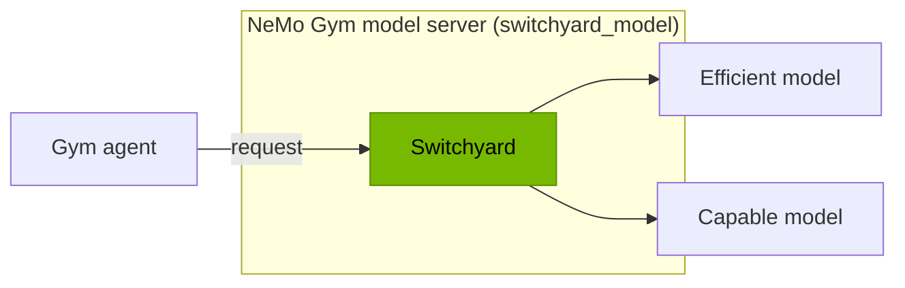

[Switchyard](https://github.com/NVIDIA-NeMo/Switchyard) routes each LLM call to the cheapest model that can still do the job. The `switchyard_model` server puts a Switchyard route behind a NeMo Gym model server, so any benchmark Gym supports can run against a router, or against a fixed baseline, without changing the agent.

By default, Gym hosts Switchyard's server for you inside the model-server process. There is nothing to install: `nemo-switchyard` is a dependency of this server, not of Gym itself. Switchyard also runs as a NeMo Relay plugin, a LiteLLM plugin, and an embeddable library; the [Switchyard README](https://github.com/NVIDIA-NeMo/Switchyard#readme) covers those. This page covers the Gym integration.



## Quick start

### 1. Write `routes.toml`

`routes.toml` is a Switchyard deployment file, the same TOML that `switchyard-server --config` reads. It has three layers: `llm_clients` (how to reach a provider), `targets` (one upstream model ID and the client that calls it), and `routes` (one client-visible model ID and the algorithm that picks between targets). This one defines a fixed baseline and the stage router from the Switchyard README, which picks a tier per turn from the agent's tool activity:

```toml
schema_version = 1

[llm_clients.openrouter]
format = "openai_chat"
base_url = "https://openrouter.ai/api/v1"
api_key_env = "OPENROUTER_API_KEY" # pragma: allowlist secret

[targets.capable]
id = "anthropic/claude-opus-4.8"
llm_client = "openrouter"

[targets.efficient]
id = "z-ai/glm-5.2"
llm_client = "openrouter"

[routes.capable-only]
id = "capable-only"
type = "passthrough"
target = "capable"

[routes.switchyard]
id = "switchyard"
type = "stage_router"
capable_target = "capable"
efficient_target = "efficient"
picker = "efficient_first"
confidence_threshold = 0.5
```

Each route is a model name an eval can target. The [TOML schema](https://github.com/NVIDIA-NeMo/Switchyard/blob/main/docs/reference/toml_schema.md) lists every key, and the [routing overview](https://github.com/NVIDIA-NeMo/Switchyard/blob/main/docs/routing_algorithms/overview.md) covers the other route types.

### 2. Run a benchmark against a route

```bash
gym eval run \
    --benchmark <name> \
    --model-type switchyard_model \
    --model switchyard \
    ++policy_model.responses_api_models.switchyard_model.deployment="$(pwd)/routes.toml"
```

`deployment` must be an absolute path. It can also come from the `SWITCHYARD_DEPLOYMENT` environment variable, in which case the override can be dropped. A bad deployment fails at startup with Switchyard's validation error rather than as a timeout mid-run. `gym env start` takes the same flags when you want persistent servers for `gym eval run --no-serve`.

<Note>
**`--model` names a route, not a model.** It must match a route's `id` in `routes.toml`, or every call fails with `model_not_found`. Which model actually serves each call is Switchyard's decision. If the agent sets its own `model`, the server replaces it with the route, so the eval always measures routing.
</Note>

## Compare routing strategies

Run the same benchmark once per route, each with its own output file and `condition_dir`. Like `deployment`, `condition_dir` is opened by the model-server process, so pass an absolute path:

```bash
for route in capable-only switchyard; do
    gym eval run \
        --benchmark <name> \
        --model-type switchyard_model \
        --model "$route" \
        --output "results/$route/rollouts.jsonl" \
        ++policy_model.responses_api_models.switchyard_model.deployment="$(pwd)/routes.toml" \
        ++policy_model.responses_api_models.switchyard_model.condition_dir="$PWD/results/$route"
done
```

`condition_dir` records what each run ran under:

| File | Written at | Contents |
|---|---|---|
| `switchyard-condition.json` | startup | Route, deployment SHA-256, a redacted copy of the TOML, and the `nemo-switchyard` version. Two runs are comparable when only `route` differs. |
| `switchyard-stats.json` | shutdown | The proxy's `/v1/stats`: per-target calls, errors, tokens, latency, and the tokens spent by LLM judges. |

Two things to get right when you compare:

- **Join rollouts on `_ng_task_index` and `_ng_rollout_index`** and drop rows that only one run has. A rollout that failed in one condition must not count in the other.
- **Add judge tokens to the routed run's cost.** Routes that call an LLM judge, such as `llm_classifier`, spend tokens on top of the served model's. They appear in `switchyard-stats.json` under `classifier`, not in the rollout's `usage`.

<Accordion title="Example: mean reward and token totals per condition">

```bash
python3 - <<'PY'
import json

def rollouts(condition):
    with open(f"results/{condition}/rollouts.jsonl") as lines:
        rows = [json.loads(line) for line in lines]
    return {(row["_ng_task_index"], row["_ng_rollout_index"]): row for row in rows}

conditions = {name: rollouts(name) for name in ("capable-only", "switchyard")}
shared = set.intersection(*(set(rows) for rows in conditions.values()))

for name, rows in conditions.items():
    rewards = [rows[key]["reward"] for key in shared]
    served_tokens = sum(rows[key]["response"]["usage"]["total_tokens"] for key in shared)
    stats = json.load(open(f"results/{name}/switchyard-stats.json"))["stats"]
    judge_tokens = stats["classifier"]["total_tokens"]["total"]
    print(f"{name}: mean reward {sum(rewards) / len(rewards):.3f}, "
          f"served-model tokens {served_tokens}, judge tokens {judge_tokens}")
PY
```

</Accordion>

## See which model served each call

Enable [model-call capture](/model-server/model-call-capture) with `++observability_enabled=true` and `++model_call_capture_dir=<absolute path>`. Each captured exchange records the response, including the model that served it.

<Warning>
Read the served model from the capture records, not from the rollout's top-level `model`. Some agent harnesses overwrite that field with the configured policy model name, which here is the route id.
</Warning>

With capture on, Gym also forwards the rollout-attempt id to Switchyard in the `x-switchyard-session-id` header. Switchyard uses it as the session id in request logs, OpenTelemetry spans, and session-affinity routing, so proxy-side routing decisions can be joined back to the rollout that produced them. Without capture, the id never reaches this server: Gym warns at startup, or refuses to start if you set `forward_session_id: true` explicitly.

## Run the proxy yourself

Set `switchyard_base_url` instead of `deployment` to attach to a proxy you run. Gym then starts nothing of its own. You need this when:

- **You run more than one worker.** Hosted mode rejects `num_workers` above 1, because each worker process would host its own proxy and split session state and stats.
- **Several model servers should share one proxy.** Routes with session affinity are stateful. Per-server proxies would not route like a single one.
- **You need a specific Switchyard build**, or the proxy must be reachable from another machine. The hosted proxy binds loopback only.

```bash
cargo install --locked switchyard-server
switchyard-server --config routes.toml --port 4000

gym eval run \
    --benchmark <name> \
    --model-type switchyard_model \
    --model switchyard \
    ++policy_model.responses_api_models.switchyard_model.switchyard_base_url=http://127.0.0.1:4000/v1
```

`switchyard_base_url` and `switchyard_api_key` can also come from the `SWITCHYARD_BASE_URL` and `SWITCHYARD_API_KEY` environment variables. If both `switchyard_base_url` and `deployment` are set, Gym attaches and logs a warning that the deployment is unused.

Comparing runs works the same way, with two differences:

- `switchyard-stats.json` counts from the proxy's start, not the run's. Its `scope` field says so. For run-level numbers, give each run its own proxy.
- Gym cannot see what build an attached proxy runs, so `nemo_switchyard_version` is `null` in the manifest. Record it yourself with `proxy_provenance`, for example `++policy_model.responses_api_models.switchyard_model.proxy_provenance.switchyard_commit=<sha>`.

<Accordion title="Per-session routing decisions">

The hosted proxy cannot write Switchyard's durable routing log. To get per-session decisions on `/v1/routing/session-stats`, run the proxy yourself with `--routing-log-file` and add `proxy_x_session_id`, the header that log keys on, to `session_id_headers`:

```bash
switchyard-server --config routes.toml --port 4000 --routing-log-file routing.jsonl

gym eval run \
    --benchmark <name> \
    --model-type switchyard_model \
    --model switchyard \
    ++policy_model.responses_api_models.switchyard_model.switchyard_base_url=http://127.0.0.1:4000/v1 \
    "++policy_model.responses_api_models.switchyard_model.session_id_headers=[x-switchyard-session-id,proxy_x_session_id]"
```

</Accordion>

## Configuration reference

| Parameter | Type | Default | Description |
|---|---|---|---|
| `deployment` | `str` | `$SWITCHYARD_DEPLOYMENT` | Absolute path of a Switchyard deployment file such as `routes.toml`. Gym hosts a proxy when this is set. |
| `switchyard_base_url` | `str` | `$SWITCHYARD_BASE_URL` | Attach to a running proxy instead of hosting one. |
| `switchyard_model` | `str` | `${policy_model_name}` | Route id to request. Set by `--model`. |
| `switchyard_api_key` | `str` | `$SWITCHYARD_API_KEY`, else `dummy` | Bearer token sent to the proxy. |
| `proxy_port` | `int` | `null` | Fixed loopback port for the hosted proxy. `null` picks a free one. |
| `condition_dir` | `str` | `$SWITCHYARD_CONDITION_DIR` | Absolute path of the directory for the condition manifest and stats snapshot. One per run. |
| `proxy_provenance` | `dict` | `{}` | Identity of an attached proxy, copied into the manifest. Ignored when hosting. |
| `forward_session_id` | `bool` | `true` | Send the rollout id to Switchyard. Needs model-call or token capture to have anything to send. |
| `session_id_headers` | `list` | `[x-switchyard-session-id]` | Header names that carry the rollout id. |
| `extra_body` | `dict` | `{}` | Merged into every upstream request body. |
| `default_headers` | `dict` | `{}` | Sent on every upstream request. |
| `max_concurrent_requests` | `int` | `null` | Cap on in-flight upstream requests. `null` is unlimited. |
