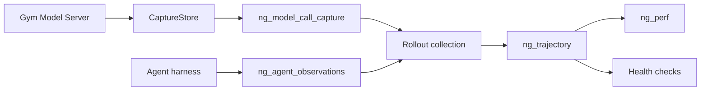

Model-call evidence records exchanges with a model. Agent observations record harness activity,
including conversations and tool execution. Rollout collection joins these sources into a
trajectory for analysis.



## Enable Collection

Set these top-level fields in the shared global configuration used by the agent servers, model
servers, and rollout collector, not inside an individual server's configuration:

```yaml
observability_enabled: true
model_call_capture_dir: /absolute/shared/path/model-calls
```

Agent processes also need `observability_enabled: true` to propagate rollout prefixes and collect
supported agent-side evidence. The model servers and rollout collector must use the same shared
capture directory. Compatible agents route model calls through
`/ng-rollout/<rollout_id>` on the Gym Model Server. Unprefixed and direct-provider calls bypass capture.
Use a separate directory for each evaluation job: rollout IDs do not contain a run ID.

Follow [Model-call Capture](/main/model-server/model-call-capture) for a runnable evaluation example.
Agent-side coverage depends on the harness and execution path; check the
[capability matrix](/main/reference/trajectory-capabilities).

## Which Artifact to Read

| Artifact | Produced by | Use |
| --- | --- | --- |
| `CaptureStore` | Model-server middleware | Original requests and responses in `<rollout_id>.capture.jsonl` |
| `ng_model_call_capture` | Collection, from capture files | Model-call index and capture metrics in rollout JSONL |
| `ng_agent_observations` | Agent harness | Source conversations, invocation relationships, tool timing, compaction, and sandbox details |
| `ng_trajectory` | Rollout collection | Canonical normalized calls, turns, tools, and gaps for downstream analysis |

After each attempt, collection joins call references and projects the available evidence into
`ng_trajectory`. Successful projection removes duplicate request and response payloads from
`ng_model_call_capture`; originals remain in `CaptureStore`. If projection fails, attached payloads
remain and a `trajectory_projection_failed` gap is recorded. LabBench's
`multimodal_history_redacted` gap indicates that trajectory payload copies were omitted.

The trajectory does not include the full compaction and sandbox records. Read
`ng_agent_observations` for those details.

## Correlation and Gaps

Collection matches calls by `model_call_id`, or by the exact pair of `model_ref` and `response_id`.
A match must be unique and consistent with any other supplied identifiers. Timestamps and list
order do not establish ownership, including for concurrent calls.

| Gap | Meaning |
| --- | --- |
| `model_call_reference_unmatched` | An explicit reference matches no captured call |
| `model_call_reference_ambiguous` | A reference matches multiple calls |
| `model_call_reference_conflict` | References disagree about call identity or ownership |
| `model_call_ownership_unavailable` | Ownership cannot be established |
| `turns_unavailable` | The producer did not supply semantic turns |
| `trajectory_projection_failed` | Collection could not normalize the evidence |

Missing evidence makes dependent health checks unobserved. Unmatched, ambiguous, or conflicting
references produce a capture-mismatch finding. A gap alone does not mean the task failed.

## Joined Example

This synthetic rollout contains one model call requesting a tool, its observed execution, and the
resulting trajectory. Optional fields are omitted. The harness provides no semantic turns, so
collection records `turns_unavailable` instead of inferring a turn from the model call.

{/* joined-rollout-example:start */}
```json
{
  "ng_model_call_capture": {
    "rollout_id": "0-0",
    "metrics": {"num_calls": 1, "tokens_in": 12, "tokens_out": 8},
    "calls": [{"model_call_id": "call-1", "tokens_in": 12, "tokens_out": 8}]
  },
  "ng_agent_observations": {
    "source": "example_agent",
    "records": [
      {
        "kind": "agent_invocation",
        "invocation_id": "root",
        "model_calls": [{"model_call_id": "call-1"}],
        "conversation": [
          {"type": "function_call", "call_id": "tool-1", "name": "lookup", "arguments": "{}"},
          {"type": "function_call_output", "call_id": "tool-1", "output": "42"}
        ]
      },
      {
        "kind": "tool_call", "invocation_id": "root", "tool_call_id": "tool-1",
        "tool_name": "lookup", "duration_ms": 200, "timing_source": "harness",
        "status": "completed"
      }
    ],
    "gaps": []
  },
  "ng_trajectory": {
    "schema_version": "1.0",
    "task_id": "task-7",
    "rollout_id": "0-0",
    "invocations": [{
      "kind": "agent_invocation",
      "invocation_id": "root",
      "model_calls": [{"model_call_id": "call-1"}],
      "conversation": [
        {"type": "function_call", "call_id": "tool-1", "name": "lookup", "arguments": "{}"},
        {"type": "function_call_output", "call_id": "tool-1", "output": "42"}
      ]
    }],
    "turns": [],
    "model_calls": [{
      "model_call_id": "call-1",
      "request": {"input": "Look up the answer"},
      "response": {"output": [
        {"type": "function_call", "call_id": "tool-1", "name": "lookup", "arguments": "{}"}
      ]},
      "token_stats": {"prompt_tokens": 12, "completion_tokens": 8}
    }],
    "tool_calls": [{
      "kind": "tool_call", "invocation_id": "root", "tool_call_id": "tool-1",
      "tool_name": "lookup", "duration_ms": 200, "timing_source": "harness",
      "status": "completed", "output": "42"
    }],
    "gaps": [{"code": "turns_unavailable"}]
  },
  "ng_perf": {
    "num_turns": 1, "num_tool_calls": 1, "token_observability_coverage": 1.0,
    "prompt_tokens": 12, "completion_tokens": 8, "total_latency_ms": 910
  }
}
```
{/* joined-rollout-example:end */}

The invocation references `call-1`. Tool timing joins the conversation output through
`(invocation_id, tool_call_id)`, giving the trajectory tool record its output of `42`.

## Add Evidence to a Custom Agent

Preserve the [rollout URL prefix](/main/model-server/model-call-capture#if-you-build-a-custom-agent)
and return an `AgentObservationBundle` as `ng_agent_observations`:

- Use stable invocation IDs and exact model-call references.
- Put model-visible tool calls and results in the invocation's conversation; put measured execution
  intervals in `ToolCallObservation`. Join them by invocation and tool-call ID.
- Record missing evidence as gaps. Sandbox usage must be measured, not copied from configured
  limits or assigned to individual overlapping tools.
- Supply explicit `TrajectoryTurn` records in a producer `ng_trajectory` when semantic turns are
  observable. Collection preserves them; it does not derive them from an invocation's conversation.

See the [observation schemas](/main/nemo-gym/nemo_gym/rollout_observability) for field definitions.

## Health and Performance

[Rollout health checks](/main/evaluation/rollout-health) read `ng_trajectory` without reopening capture
files. They check evidence integrity; the verifier determines task success.

`ng_perf` summarizes invocation-owned calls and tools. Its turn count uses explicit turns, then
owned model-call counts, then one per invocation. This fallback explains `num_turns: 1` in the
example even though semantic turns are unavailable. Token totals include only observed values;
`token_observability_coverage` reports matched calls divided by counted turns, capped at one.

Collection adds measured wall-clock latency when available. `ng_perf` is absent when observability
is disabled or no valid trajectory invocation exists. Aggregate metrics include `perf_summary`
when rollouts contain `ng_perf`.
