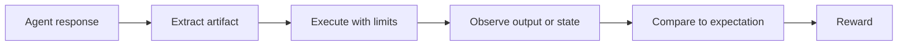

import { NavButton } from "../../../../../components/NavButton";

Use **execution and state matching** when correctness is best defined by what an answer does. Instead of comparing the answer text to a reference string, the verifier runs generated code, SQL, tool calls, or a formal proof and scores an observable result.

<NavButton href="/build-verifiers/verification-patterns" label="Back to Verification Patterns" direction="back" />

---

## Quick Mental Model

An execution-based verifier follows the same four steps across domains:

1. **Extract** an executable artifact from the rollout, such as a code block, SQL query, or tool calls.
2. **Execute** it with explicit limits in an isolated or task-local environment.
3. **Observe** the output, test results, compiler status, or final state.
4. **Compare and score** that observation against task-specific expectations.



This pattern accepts multiple valid implementations naturally. Two programs can use different algorithms, and two tool traces can take different paths, while still producing the same correct result.

<Warning>
Generated code and tool calls are untrusted input. A timeout or semaphore limits resource use but does not provide security isolation. Use a sandbox or container when the verifier executes code that can access the host.
</Warning>

---

## Choose the Observable

Define correctness at the most semantic layer that you can evaluate deterministically:

| Task | Execute | Compare |
|---|---|---|
| Code generation | Generated program against tests | Test outcomes or stdout |
| Text-to-SQL | Predicted and reference queries on the same database | Result sets |
| Tool-use workflow | Predicted and reference actions in separate fresh environments | Resulting state |
| Formal proof | Completed source with the proof compiler | Compiler status and forbidden placeholders |
| Hardware or systems code | Generated files with a test harness in a sandbox | Harness exit status and reports |

Avoid comparing implementation details when the task only requires an outcome. For example, compare SQL result sets instead of SQL strings, and compare final application state instead of requiring the exact reference tool sequence.

---

## Code Execution Against Tests

A code verifier extracts code, combines it with task-specific tests, executes it under a timeout, and maps the test outcome to a reward.

The [`bigcodebench`](https://github.com/NVIDIA-NeMo/Gym/tree/main/resources_servers/bigcodebench) server runs each candidate in a dedicated virtual environment subprocess. Its core flow is:

```python
async with self._semaphore:
    result = await self._run_in_venv(
        code=calibrated,
        test_code=meta["test"],
        entry_point=meta["entry_point"],
    )

reward = 1.0 if result.get("status") == "pass" else 0.0
```

The subprocess has a hard outer timeout and decodes arbitrary output without crashing on non-UTF-8 bytes:

```python
proc = await asyncio.create_subprocess_exec(
    python,
    runner,
    stdin=asyncio.subprocess.PIPE,
    stdout=asyncio.subprocess.PIPE,
    stderr=asyncio.subprocess.PIPE,
)
try:
    stdout, stderr = await asyncio.wait_for(
        proc.communicate(payload),
        timeout=subprocess_timeout,
    )
except asyncio.TimeoutError:
    proc.kill()
    await proc.wait()
    return {"status": "timeout"}

text = stdout.decode("utf-8", errors="replace")
```

For distributed evaluation, put the blocking checker in a Ray task. [`code_gen`](https://github.com/NVIDIA-NeMo/Gym/tree/main/resources_servers/code_gen), [`evalplus`](https://github.com/NVIDIA-NeMo/Gym/tree/main/resources_servers/evalplus), and [`code_fim`](https://github.com/NVIDIA-NeMo/Gym/tree/main/resources_servers/code_fim) use Ray remote functions to isolate work and distribute it across workers:

```python
@ray.remote(scheduling_strategy="SPREAD")
def check_correctness_remote(sample, generation, timeout):
    return check_correctness(sample, generation, timeout)

results = await check_correctness_remote.remote(sample, code, timeout)
```

Ray futures are directly awaitable. In async server code, use `await future`; do not call `ray.get()`, which blocks the event loop.

Other examples:

- [`competitive_coding_challenges`](https://github.com/NVIDIA-NeMo/Gym/tree/main/resources_servers/competitive_coding_challenges) checks competitive-programming inputs and outputs.
- [`nvarc`](https://github.com/NVIDIA-NeMo/Gym/tree/main/resources_servers/nvarc) executes a generated Python transformation and validates its returned grid.

---

## SQL Execution Against a Database

Text-to-SQL verification should compare query semantics, not query text:

1. Extract the predicted SQL.
2. Execute the reference query against the task database.
3. Execute the predicted query against the same database.
4. Normalize and compare the result sets.

[`bird_sql`](https://github.com/NVIDIA-NeMo/Gym/tree/main/resources_servers/bird_sql) runs SQLite work in a bounded worker thread so blocking database calls do not block the event loop:

```python
async def execute_sqlite_async(db_path, sql, semaphore, timeout_s):
    async with semaphore:
        try:
            return await asyncio.wait_for(
                asyncio.to_thread(execute_sqlite, db_path, sql),
                timeout=timeout_s,
            )
        except asyncio.TimeoutError:
            return None

gold_rows = await execute_sqlite_async(db_path, gold_sql, semaphore, timeout_s)
pred_rows = await execute_sqlite_async(db_path, pred_sql, semaphore, timeout_s)
match = gold_rows is not None and pred_rows is not None and set(gold_rows) == set(pred_rows)
```

Result normalization is benchmark-specific. Decide whether row order, duplicate rows, floating-point tolerance, column order, and `NULL` values are significant. Record execution errors separately from valid but incorrect results so infrastructure failures are diagnosable.

[`spider2_lite`](https://github.com/NVIDIA-NeMo/Gym/tree/main/resources_servers/spider2_lite) is another execution-based SQL example and uses Ray for its evaluator.

---

## State Matching for Tool Use

Exact tool-call matching can reject a correct trajectory merely because the agent took a different valid route. State matching instead asks whether the agent produced the intended world state.

Use two independently initialized environments:

```python
predicted_env = create_fresh_environment()
reference_env = create_fresh_environment()

execute_actions(predicted_env, predicted_actions)
execute_actions(reference_env, reference_actions)

predicted_state = normalize(snapshot(predicted_env))
reference_state = normalize(snapshot(reference_env))
reward = float(predicted_state == reference_state)
```

[`workplace_assistant`](https://github.com/NVIDIA-NeMo/Gym/tree/main/resources_servers/workplace_assistant) applies this pattern across calendar, email, analytics, project-management, and CRM state. It executes the predicted and ground-truth actions in separate fresh tool environments, normalizes fields where comparison is case-insensitive, and requires every relevant state table to match:

```python
predict_env = execute_actions_and_reset_state(predicted_actions)
ground_truth_env = execute_actions_and_reset_state(ground_truth_actions)

return (
    predicted_calendar_state.equals(ground_truth_calendar_state)
    and predicted_email_state.equals(ground_truth_email_state)
    and predicted_project_management_state.equals(ground_truth_project_management_state)
    and predicted_crm_state.equals(ground_truth_crm_state)
)
```

Keep the live rollout state separate from both verification environments. Replaying actions from a clean baseline prevents the reference run from seeing mutations made by the agent and makes verification reproducible.

Define a canonical state projection rather than comparing every internal field. Ignore timestamps, generated IDs, caches, and other nondeterministic fields unless they are part of the task contract.

---

## Formal Compilation

For formal mathematics, successful compilation is a deterministic correctness signal. The verifier builds a complete proof file from the task statement and generated proof, invokes the compiler in a sandbox, and checks both process status and benchmark-specific forbidden constructs.

[`math_formal_lean`](https://github.com/NVIDIA-NeMo/Gym/tree/main/resources_servers/math_formal_lean) uses this flow:

```python
predicted_proof = build_lean4_proof(
    generation=body.response.output_text,
    data_point={"header": body.header, "formal_statement": body.formal_statement},
    config=self._proof_build_config,
)

compiler_output = await self._sandbox_client.execute_lean4(
    code=predicted_proof,
    timeout=self.config.compilation_timeout,
)
proof_status = determine_proof_status(compiler_output)
reward = 1.0 if proof_status == "completed" else 0.0
```

Compilation success alone may not be sufficient if the language permits placeholders or unsound escape hatches. The Lean verifier also inspects output for incomplete proofs such as `sorry`. Apply the equivalent policy for the formal system you use.

Compiler diagnostics are useful observations, not only failures. `math_formal_lean` returns structured error feedback so an agent can revise the proof in a later turn.

---

## Sandbox and Container Execution

Use a sandbox when generated artifacts need compilers, simulators, system tools, or stronger isolation than a subprocess provides.

[`cvdp`](https://github.com/NVIDIA-NeMo/Gym/tree/main/resources_servers/cvdp) verifies generated RTL and testbench files with task-provided harnesses. It translates Docker Compose metadata into an Apptainer sandbox specification, creates a temporary workspace per rollout, runs the harness, and always closes the sandbox:

```python
with tempfile.TemporaryDirectory(prefix=f"cvdp_{task_id}_") as workdir:
    write_harness_files(workdir, harness_files)
    write_generated_files(workdir, rtl_files)

    handle = await provider.create(sandbox_spec)
    try:
        result = await provider.exec(
            handle,
            command,
            timeout_s=container_timeout,
        )
    finally:
        await provider.close(handle)

reward = 1.0 if result.return_code == 0 else 0.0
```

Treat file paths, environment variables, container mounts, and harness content as untrusted. Resolve every requested path under the rollout workspace, mount only required directories, and avoid exposing host credentials or sockets.

---

## Concurrency, Timeouts, and Cleanup

Execution verifiers can exhaust CPUs, file descriptors, processes, database connections, or sandbox capacity. Bound the expensive region, not just request admission:

```python
def model_post_init(self, context):
    self._semaphore = asyncio.Semaphore(self.config.num_processes)

async def verify(self, body):
    async with self._semaphore:
        result = await run_with_timeout(body)
    return build_verify_response(result)
```

Use all of the following where applicable:

- **Semaphore:** cap concurrent subprocesses, queries, compilers, or sandboxes.
- **Timeout:** enforce an outer wall-clock limit and terminate timed-out work.
- **Output limit:** truncate retained stdout and stderr to keep responses and logs bounded.
- **Robust decoding:** decode subprocess bytes with `errors="replace"`.
- **Per-task isolation:** create fresh databases, state containers, or workspaces when mutations are possible.
- **Guaranteed cleanup:** reap subprocesses and close sandboxes in `finally`; use temporary-directory context managers for files.
- **Structured outcomes:** distinguish `incorrect`, `timeout`, `execution_error`, and `verifier_error`.

<Info>
A failed execution normally earns the task's failure reward. A verifier infrastructure failure is different: preserve enough structured detail to diagnose or retry it instead of silently treating every failure as an incorrect model answer.
</Info>

---

## Checklist

1. Define the executable artifact and how it is extracted.
2. Choose an observable that captures task semantics.
3. Specify normalization and comparison rules.
4. Isolate untrusted execution and set resource limits.
5. Bound concurrency and enforce timeouts.
6. Clean up processes, workspaces, sessions, and sandboxes on every path.
7. Return structured diagnostics alongside the reward.
8. Test correct, incorrect, malformed, timed-out, and crashing candidates.

---

## Related Topics

- [Build Verifiers](/build-verifiers) — resources server interfaces and verification overview
- [Verification Patterns](/build-verifiers/verification-patterns) — other scoring approaches
- [Environment Components](/about/architecture) — where resources servers fit in a rollout
- [Deployment Topology](/infrastructure/deployment-topology) — scaling servers and execution workers
