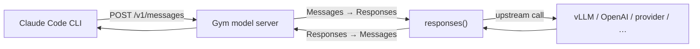

Every NeMo Gym model server speaks the [Anthropic Messages API](https://docs.anthropic.com/en/api/messages) in addition to Responses and Chat Completions. That means Anthropic-native harnesses — notably the [Claude Code](https://code.claude.com/docs/en/overview) CLI — can target **any** Gym model backend (vLLM, OpenAI, Inference Providers, and so on) without a separate Anthropic proxy.

## How it works

`SimpleResponsesAPIModel` registers `POST /v1/messages` on every model server by default. The handler maps the inbound Anthropic Messages request to Gym's native Responses schema, calls that server's own `responses()` implementation (whatever upstream the server is configured for), and maps the result back to an Anthropic Messages response. When the client sets `stream: true` (Claude Code always does), the complete response is re-emitted as a synthesized Anthropic SSE event stream.



You do not configure a separate "Claude model" server. Point Claude Code at any existing Gym model server URL; the `/v1/messages` dialect is already there.

## Wire Claude Code to a Gym model server

The built-in [`claude_code_agent`](https://github.com/NVIDIA-NeMo/Gym/tree/main/responses_api_agents/claude_code_agent) runs `claude -p` as a subprocess. Set its `model_server` ref to the Gym model server you want to use. That ref takes precedence over `anthropic_base_url`: the agent resolves `ANTHROPIC_BASE_URL` to the model server, and the CLI appends `/v1/messages`.

The showcase config [`reasoning_gym_claude_code_agent_model_server.yaml`](https://github.com/NVIDIA-NeMo/Gym/blob/main/resources_servers/reasoning_gym/configs/reasoning_gym_claude_code_agent_model_server.yaml) already wires `model_server` to `policy_model`. Compose it with any model server:

```bash
gym env start \
  --resources-server reasoning_gym/reasoning_gym_claude_code_agent_model_server \
  --model-type vllm_model
```

This path needs only the model server's credentials (`policy_base_url`, `policy_api_key`, `policy_model_name` in `env.yaml` or as `+` overrides) — no `anthropic_*` variables.

```bash
gym eval run --no-serve \
    --agent reasoning_gym_claude_code_agent_model_server \
    --input resources_servers/reasoning_gym/data/example.jsonl \
    --output results/claude_code_via_model_server_rollout.jsonl \
    --limit 1
```

### Choose the right model type

| Model type | Upstream API | When to use |
|---|---|---|
| `vllm_model` | OpenAI-compatible **chat** (`/chat/completions`) | vLLM, NVIDIA API, most hosted chat providers |
| `openai_model` | OpenAI **Responses** (`/responses`) | OpenAI / Azure Responses endpoints only — chat-only hosts return 404 |
| `inference_provider` | Provider chat Completions | Fireworks, Together.ai, OpenRouter, and other [Inference Providers](/model-server/inference-providers) |

### Config snippet

To wire Claude Code yourself, set `model_server` on the agent and leave `anthropic_base_url` null:

```yaml
my_claude_agent:
  responses_api_agents:
    claude_code_agent:
      entrypoint: app.py
      resources_server:
        type: resources_servers
        name: my_verifier
      model_server:
        type: responses_api_models
        name: policy_model
      model: ${policy_model_name}
      anthropic_api_key: EMPTY
      anthropic_base_url: null
      concurrency: 32
      max_turns: 30
```

With `model_server` set, model calls go through Gym and can be recorded by [model-call capture](/model-server/model-call-capture). Direct Anthropic or `anthropic_base_url` runs bypass Gym capture.

## Call Anthropic (or another Messages endpoint) directly

If you want Claude Code to hit Anthropic's API — or any other host that already speaks `/v1/messages` — omit `model_server` and set the Anthropic credentials instead:

```yaml
# env.yaml
anthropic_api_key: sk-ant-...
anthropic_model_name: claude-sonnet-4-6
anthropic_base_url: null   # null = real Anthropic API
```

For a local vLLM or Ollama endpoint that already serves Messages:

```yaml
anthropic_api_key: EMPTY
anthropic_model_name: Qwen/Qwen3-4B-Instruct-2507
anthropic_base_url: http://localhost:8000
```

<Note>
`anthropic_base_url` must **not** include `/v1`. Claude Code appends `/v1/messages` itself.
</Note>

```bash
gym env start --resources-server reasoning_gym/reasoning_gym_claude_code_agent

gym eval run --no-serve \
    --agent reasoning_gym_claude_code_agent \
    --input resources_servers/reasoning_gym/data/example.jsonl \
    --output results/claude_code_rollout.jsonl \
    --limit 1
```

## Smoke-test `/v1/messages`

Launch a model server, take its URL from the `gym env start` log (`'url': 'http://127.0.0.1:<port>'`), then:

```bash
gym env start --model-type vllm_model \
  +policy_base_url=https://integrate.api.nvidia.com/v1 \
  '+policy_api_key=${oc.env:NVIDIA_API_KEY}' \
  +policy_model_name=meta/llama-3.1-8b-instruct

# 1. Proxy speaks Anthropic Messages (add "stream": true for the SSE path):
curl $URL/v1/messages -H 'content-type: application/json' \
  -d '{"model":"x","max_tokens":64,"messages":[{"role":"user","content":"2+2?"}]}'

# 2. Real Claude Code CLI against the same server:
ANTHROPIC_BASE_URL=$URL ANTHROPIC_AUTH_TOKEN=local \
  claude -p --output-format stream-json --max-turns 2 \
  --model meta/llama-3.1-8b-instruct -- "What is 2+2?"
```

## Related

- Agent runtime options (`bare`, MCP, skills, thinking): [`claude_code_agent` README](https://github.com/NVIDIA-NeMo/Gym/tree/main/responses_api_agents/claude_code_agent)
- Skills evaluation pattern: [Agent Skills](/agent-server/agent-skills)
- MCP tools from a Resources Server: [MCP Resources Server](/environment-tutorials/mcp-resources-server)
- Capture model HTTP evidence: [Model-call capture](/model-server/model-call-capture)
