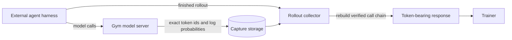

# Training on External Agent Harnesses

An external agent harness runs its own model-calling loop and returns a finished transcript to Gym. Claude Code is one example. The transcript contains the conversation text, but it does not contain the exact token ids and log probabilities produced by each model call.

Training needs those original token ids. Re-tokenizing the final text can produce a different sequence from the one sampled by the policy. Gym's training-token capture records the ids while they are still available in the model server, associates the calls with their rollout, and rebuilds them into the token-bearing response expected by the trainer.

## Decide whether you need token capture

| Agent behavior | What to do |
|---|---|
| The agent returns Responses API output items that already contain generated token ids. | Train on the returned response. Gym preserves these native token ids. |
| The agent drives its own model calls and returns only text or a wire format without token ids. | Enable training-token capture. |
| The agent returns token ids in a format Gym does not recognize. | Enable capture for now and open an issue describing the returned format. |

Ordinary evaluation does not require training-token capture. Enable it when the collected rollouts will be used to optimize a policy.

## How capture works



Every model call carries the rollout id. For a multi-call rollout, Gym verifies which earlier call the new request continues. After the harness finishes, Gym reads the captured calls and replaces the rollout's text-only `response.output` with output items that carry the original token ids and log probabilities.

Gym does not guess when a call is missing or its parent cannot be proven. It sets `mask_sample: true` so the trainer can exclude that rollout from the loss.

## Configure local capture

The default setup writes capture records to a node-local directory and lets Gym rebuild the response.

### 1. Configure the model server for training

Use `responses_api_models/vllm_model/configs/vllm_model_for_training.yaml` as the model-server config. It enables token information in model responses.

External harnesses often omit sampling parameters or send serving-oriented defaults. Pin the parameters used by training with `sampling_overrides` so every request uses the policy's intended sampling configuration:

```yaml
policy_model:
  responses_api_models:
    vllm_model:
      return_token_id_information: true
      sampling_overrides:
        temperature: 1.0
        top_p: 1.0
        top_k: -1
```

Replace the example values with the sampling settings used by the trainer. If the training framework starts vLLM, keep its tokenizer enabled. For NeMo RL, set `policy.generation.vllm_cfg.skip_tokenizer_init: false`.

### 2. Enable the capture store

Add the run-wide capture settings:

```yaml
env:
  nemo_gym:
    token_id_capture:
      enabled: true
      dir: /tmp/nemo_gym_token_id_captures
      delta_records: true
      max_mask_fraction: 0.5
```

`delta_records: true` avoids storing the growing full prompt again for every resolved continuation. Root and unresolved calls remain self-contained so Gym can diagnose a broken chain.

`max_mask_fraction` is an optional safety limit. After at least `mask_fraction_min_samples` finalized rollouts, collection stops if the masked fraction exceeds this value. Omit it to disable the limit.

### 3. Opt in the external agent

Enable capture on each external harness that returns no token ids:

```yaml
claude_code_agent:
  responses_api_agents:
    claude_code_agent:
      token_id_capture: true
```

Both the run-wide `enabled` setting and the agent opt-in are required. To capture every configured agent, set `token_id_capture.all_agents: true` instead of setting the flag on each agent.

<Note>
Native Gym agents normally leave `token_id_capture` disabled because their responses already contain the token ids needed for training.
</Note>

### 4. Confirm that tool calls are enabled

A tool-call parser converts model output into structured calls that the harness can execute. Without the correct parser, an agentic rollout may stop after one model call even though capture itself is working.

Configure the parser expected by the model, such as `tool_parser: hermes` in the inference server's chat-serving settings. Check `n_calls` on the first collected rollouts before relying on reward results.

## Consume the rebuilt rollout

When `rebuild_response` remains at its default value of `true`, `gym eval run` performs the complete lifecycle:

1. The model server records every correlated call.
2. Gym freezes the records after the harness and verifier finish.
3. Gym reconstructs one verified model-call chain and updates `response.output`.
4. Gym writes the rollout result durably.
5. Gym retires successfully consumed capture records.

The trainer reads the rebuilt `response.output` in the same way it reads output from a native agent. Prompt positions provide context, while generated positions retain the captured log probabilities used for policy optimization.

Masked or failed builds are retained for diagnosis. Successfully delivered records are removed after the output row is durable.

## Check the first run

Gym adds capture metrics under `_ng_token_capture` on each rebuilt rollout.

| Field | Healthy value | What an unexpected value usually means |
|---|---|---|
| `n_calls` | Greater than 1 for a tool-using rollout | The harness did not execute a tool, often because the tool parser is missing or incompatible. |
| `terminal_attribution.chain` | `delivered` | Gym could not connect the verifier-scored response to an intact captured chain. |
| `chains` | `1` for a simple rollout | The harness made independent side calls, retried a call, or forked another agent. |
| `delivered_fraction` | `1.0` for a simple rollout | Some sampled tokens belonged to calls outside the delivered chain. This can be expected when terminal attribution safely excludes side calls. |
| `quarantined_calls` | `0` | Gym found conflicting candidates and refused to choose between them. |
| `empty_generation_calls` | `0` | A model call produced no trainable generated tokens. |
| `unresolved_parent_calls` | `0` | A continuation could not be linked to exactly one verified earlier call. |
| `mask_sample` | Absent or `false` | The rollout is incomplete or ambiguous and must not contribute to the loss. |

A rollout with no `_ng_token_capture` field was not rebuilt. Verify that capture is enabled, the agent is opted in, and its model calls use the rollout-correlated model-server URL.

## Optionally supply exact prefix tokens

Some harnesses reshape an assistant turn before sending the next request. A chat template or reasoning template can also render the previous turn differently. In these cases, the next prompt may not begin with the tokens that the policy actually sampled.

Prefix supply asks a compatible inference backend to begin the next prompt with the verified parent's exact tokens. Enable the Gym model-server side with this config overlay:

```text
responses_api_models/vllm_model/configs/vllm_model_supply_prefix.yaml
```

The backend must support Gym's required-prefix request and return the prompt token ids actually used for generation. Gym verifies that evidence before accepting prefix supply. A missing or mismatched proof fails the model call instead of silently producing an off-policy capture.

<Warning>
Stock vLLM does not implement this prefix-supply extension. Leave the overlay disabled unless the inference backend supports both the required-prefix request and generation-time prompt-token response. Capture can still work without prefix supply when each rendered prompt naturally extends the preceding sampled tokens.
</Warning>

Prefix supply is not supported with `use_completions_api: true` or `is_responses_native: true`.

## Use framework-owned capture storage

The default file store is intended for a model server and rollout collector that share one node-local directory. A distributed training system can instead provide a shared transport.

Configure a sink and lineage resolver that connect to the same backend:

```yaml
env:
  nemo_gym:
    token_id_capture:
      enabled: true
      sink: my_package.capture:CaptureSink
      sink_kwargs:
        endpoint: ${oc.env:CAPTURE_ENDPOINT}
      lineage_store: my_package.capture:CaptureLineageStore
      lineage_store_kwargs:
        endpoint: ${oc.env:CAPTURE_ENDPOINT}
      delta_records: true
      rebuild_response: false
```

The sink receives completed call records from each model-server worker. The lineage resolver lets any worker find a previously committed call from the same rollout. The framework creates a source in its rollout-consumer or trainer process to freeze and read the same records.

With `rebuild_response: false`, Gym stops after capture. The framework then performs the consumer side:

```python
from nemo_gym.token_id_capture.delivery import (
    finalize_rollout_token_capture,
    retire_rollout_token_capture,
)

built = await finalize_rollout_token_capture(result, source)
await downstream.put(result)  # Establish the framework's durability boundary.
await retire_rollout_token_capture(rollout_id, source, built)
```

Call `finalize_rollout_token_capture` before training and exclude any result with `mask_sample: true`. Call `retire_rollout_token_capture` only after the rebuilt result has been accepted by durable downstream storage.

Run `nemo_gym.token_id_capture.conformance.run_conformance` against custom sink, source, and lineage factories before using the transport for training. For a multi-process deployment, run the check with independent clients connected to the real shared backend.

<Warning>
Configure sink and lineage classes by import path so Gym constructs them inside every model-server worker. Installing an object only in the launcher process does not configure separately spawned workers.
</Warning>

## Provide unique rollout ids

Gym normally derives the capture id from the task and rollout indices. If a custom training loop restarts those indices on each step, explicitly provide a unique `_ng_rollout_id`:

```python
row["_ng_rollout_id"] = f"step{step}.{task_index}-{rollout_index}"
```

The id may contain letters, digits, dots, dashes, and underscores, and it must begin with a letter or digit.

## Current limitations

- Gym delivers one verified model-call chain per rollout. When Gym can attribute the verifier-scored response to a captured terminal call, it delivers that call's intact ancestor chain and excludes unrelated calls. Without terminal attribution, multiple plausible chains cause masking.
- Harness-generated title, compaction, retry, or sub-agent calls can appear as additional chains. Inspect `terminal_attribution`, `chains`, and `delivered_fraction` to confirm that Gym selected the intended chain.
- Full-tree training requires a trainer data contract that accepts multiple related trajectories.
- Prefix supply requires a compatible inference backend and is not available in stock vLLM.
